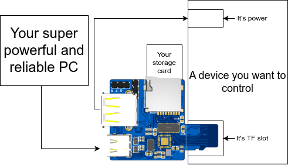

# RemoSwitch

## Introduction

This project is designed to help with remote control/automatic testing. It equips with following features:
- Switching a TF card(microSD card) between two devices
- An onboard USB-TTL chip, which can be used to communicate with other devices
- An USB-A port with ability to control it's power

## Typical Use Cases

If you want to remote/automatically control a development board, such as Raspberry Pi or any similar devices, you can use this device to switch the TF card between two devices, and control its power supply:


## Quick Start

### Firmware

If your device isn't pre-flashed with the firmware, you can use the following steps to flash it:
1. Download the firmware from the newest releases. The name should contains `CH32v203G6U6` and end with `.elf` or `.bin`.
2. Get the [wch-isp](https://github.com/ch32-rs/wchisp) tool, which is used to flash the firmware.
3. Short the `Boot0` pin on the device to enter the bootloader mode. Look to the bottom of the tf card slot, you can find two holes, connect them. Meanwhile, connect the device to your computer using a USB cable to power it on.
4. Flash it! `wchisp flash firmware-CH32V203G6U6.bin`
5. Check the device is working by connecting it to your computer. You shall see a USB device with VID:PID `0x1209:0x7410`, which is the device.

### Software

The host control program is written in Rust. There're pre-built binaries for Windows, Linux and MacOS available in the releases page. Note that the program is only tested against Linux. Please report it if you find and issues in the issues page.

### Usage

*Note: some commands may require root permission to function correctly.*

First, you need to check whether the device is connected to your computer. 
You could use command `remo -l` to list available devices. With the device properly connected to the computer, you shall see its information like, this:
```log
Found 1 devices:
Index   Device ID       Path
0       69F4A37B        /dev/hidraw6
```

Then, you can choose the device by using following methods:
- `remo -i 0` to select the device with index 0
- `remo -d 69F4A37B` to select the device with ID `69F4A37B`
- `remo -p /dev/hidraw6` to select the device with path `/dev/hidraw6`

Change the index, ID or path to your own device.

After selecting the device, you can use the following commands to control the device.

#### Current Device Status

Using the option `-s` or `--status` to check the current device status. For example:
```bash
remo -i 0 -s
```

You shall see the current device status like this:
```log
Status: 
        Mux: Open,
        Host: Connected,
        Dut: Disconnected,
        Board Power: On
```

#### Switch TF Card

Using the option `-m` or `--mux` to switch the TF card between two devices. To switch the TF card to device host(i.e. the device which is connected to the device via the USB-C port), you can use `host` as the argument; to switch the TF card to device client(i.e. the device which is connected to the device via the TF plug), you can use `dut` as the argument. For example:
```bash
remo -i 0 -m host
remo -d 69F4A37B -m dut
```

Besides, you can also use `on` or `off` as the argument to switch on or off the TF card switch. If off, all tf-data will be Hi-Z.

#### Power the on-board USB Port

Option `-p` or `--pwr` could be used to power the on-board USB Type-A port. Either `on` or `off` should be supplied as the argument. For example:
```bash
remo -i 0 -p on
remo -d 69F4A37B -p off
```

## Details Usage

### Make the PCB

Here are some notice:
- Please: Electroless Nickel Immersion Gold
- Please: 0.8mm thickness
- Please: Add Break-up tab and Markpiont by yourself
- Recommend: Rotate the PCB 15 degrees
- Avoid: add any connection to the TF card plug when adding the margin (or you WILL HAVE A BAD TIME thinking how to remove the PCB margin)

These parts are optional, but recommended:
- A XTAL crystal for the MCU: improves the stability in bad working conditions
- A XTAL crystal for the HUB: some CH334P may not have the internal RC clock.
- All ESD-prevention parts: you don't want the ESD kill your device through the USB port/TF plug :)

These parts are not needed, unless in some special cases:
- The second CH217 switch: you want up to 5A current. Well... We provide this possibility, but... Consider some outside solution? ~(An exposed relay to control the 110-220V power supply IS NOT A GOOD IDEA)~
- The XTAL cristal for the TF reader: high speed/wont't work without it .

### Building the Firmware

Use `PlatformIO` to build the firmware. Use the `genericCH32V203G6U6`/`genericCH32V203C8T6` based on your version of the device.

### Building the Software

If you want to use any other target, you can use the following command to build the software:
```bash
cargo build --release
```

In theory, the software should work on any platform which has the `hidapi` library, but only Linux is tested.

### Debugging

For regular users, you can ignore this part.

The software provides control over individual GPIO pins, which can be used to debug the hardware. You can use the `d` or `debug` subcommand to control the GPIO pins. For example, you can use the following command to set the MUX_EN pin to high:
```bash
remo -i 0 d MuxEn 1
```

The following command can be used to check the current GPIO status:
```bash
remo -i 0 d AllStatus 0
```

An ACM uart port (115200 baud) is available for debugging using the USB-CDC port. You can use any serial terminal to connect to the port.

If you want to debug something earlier than the usb initialization, you can connect to the onboard serial port for the MCU using a USB-TTL adapter. Check the `Hardware` folder for the pinout. The serial port is using 115200 baud.

## Inspiration

This project is inspired by following projects:
- [usb sd mux](https://linux-automation.com/en/products/usb-sd-mux.html) - A commercial USB2.0 USB SD card switcher(not open source)
- [SD Wire C](https://github.com/Badger-Embedded/badgerd-sdwirec) - An open source USB2.0 SD card switcher
- [usb sd mux fast](https://linux-automation.com/en/products/usb-sd-mux-fast.html) - A commercial USB SD card switcher with USB3.0 support(not open source)
- [AvaotaHyperCard](https://github.com/AvaotaSBC/AvaotaHyperCard) - Manually controlled SD card

## Contributors

Thanks to the following contributors for their contributions:
- Raaath Beeeee helped with the hardware debugging
- [Queally rw](https://github.com/BeRealQueally) helped with the hardware design and soldering
- [Yao Zi](https://github.com/ziyao233/) <ziyao@disroot.org> helped with the hardware testing, and documentation
- And any other contributors who have contributed to this project.

Without their help, this project would not be possible :)

## Copyright

Copyright (c) 2025 Wang Ling <lingwang@wcysite.com>.
Copyright (c) 2025 Rath.
All rights reserved.

License:
- Software part: Apache-2.0 (in folder `Software`)
- Hardware part: CERN-OHL-S-2.0 (in folder `Hardware`)
- Firmware part: GPL-3.0 (in folder `Firmware`)

(In my own understanding, communicating with the hardware part using any sort of communication protocol is not considered as a derivative work?)

### Copyright Notice

We use the MIT-licensed library tinyusb. There're some optional changes in downstream.

The firmware framework is using `PlatformIO` and the wch chip support, they are all under Apache-2.0 license.

Thanks to `pid.codes` for the USB PID, which is under CC0 license.
